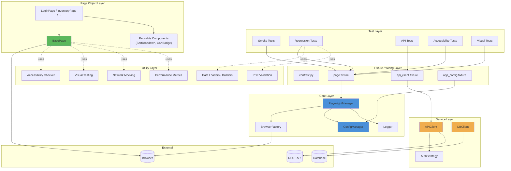
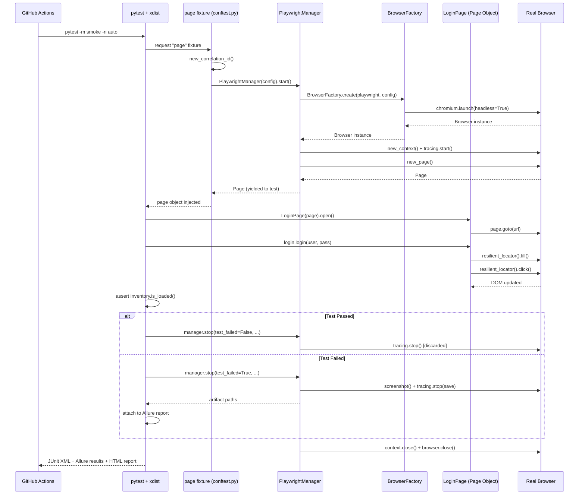
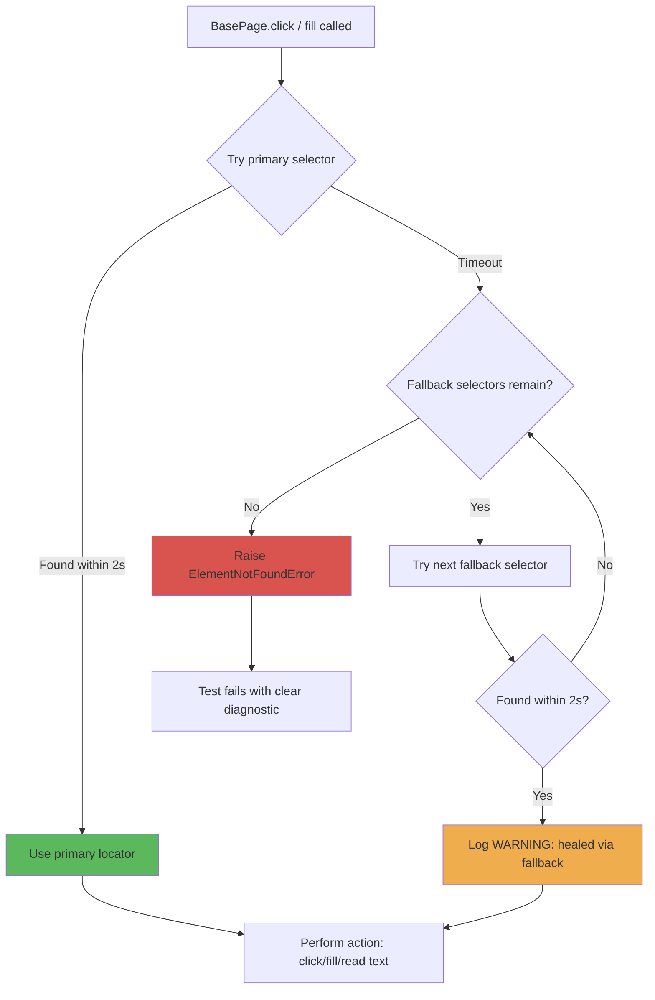
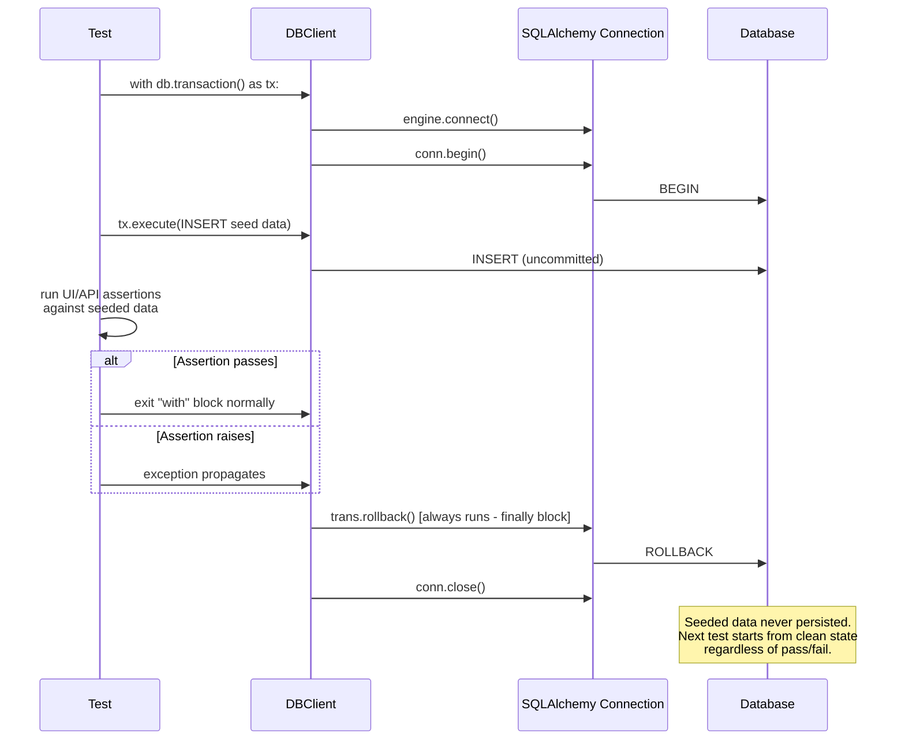

# Architecture & Sequence Diagrams

## 1. Layered Architecture

**Reading this diagram in an interview:** point at the dependency direction — tests depend on fixtures, fixtures depend on core/service layers, page objects depend only on BasePage + Playwright's Page object. Nothing in Core or Service layers imports anything from Test or Page Object layers. That one-directional dependency flow is *the* answer to "how did you keep this maintainable at scale" — you can change a page object without touching PlaywrightManager, and vice versa.

---

## 2. Test Execution Sequence (UI test, happy path)

---

## 3. Self-Healing Locator Flow

---

## 4. CI/CD Deployment Pipeline

```mermaid
flowchart LR
    A[Developer commits] --> B[Push to feature branch]
    B --> C[Open Pull Request]
    C --> D[PR Validation Workflow]

    D --> D1[Lint: Black/isort/Ruff]
    D --> D2[Type check: mypy]
    D1 & D2 --> D3[Smoke tests<br/>3-browser matrix]
    D3 --> D4[API tests]
    D4 --> E{All checks green?}

    E -->|No| F[Slack notify: PR failed]
    F --> B

    E -->|Yes| G[Human code review]
    G --> H[Merge to main]

    H --> I[Nightly Regression<br/>3 browsers x 2 Python versions]
    I --> J[Publish Allure report to GitHub Pages]
    J --> K{Regression green?}
    K -->|No| L[Teams alert]

    H -.tag release.-> M[Release Pipeline]
    M --> N[Full suite: smoke+regression+api]
    N --> O{Pass?}
    O -->|Yes| P[Tag GitHub Release]
    O -->|No| Q[Block release, notify]
    P --> R[Production Deployment]
    R --> S[Scheduled Smoke<br/>every 2h prod sanity]

    style E fill:#f0ad4e
    style O fill:#f0ad4e
    style P fill:#5cb85c
    style F fill:#d9534f
    style Q fill:#d9534f
```

---

## 5. Database Transaction Isolation Pattern

