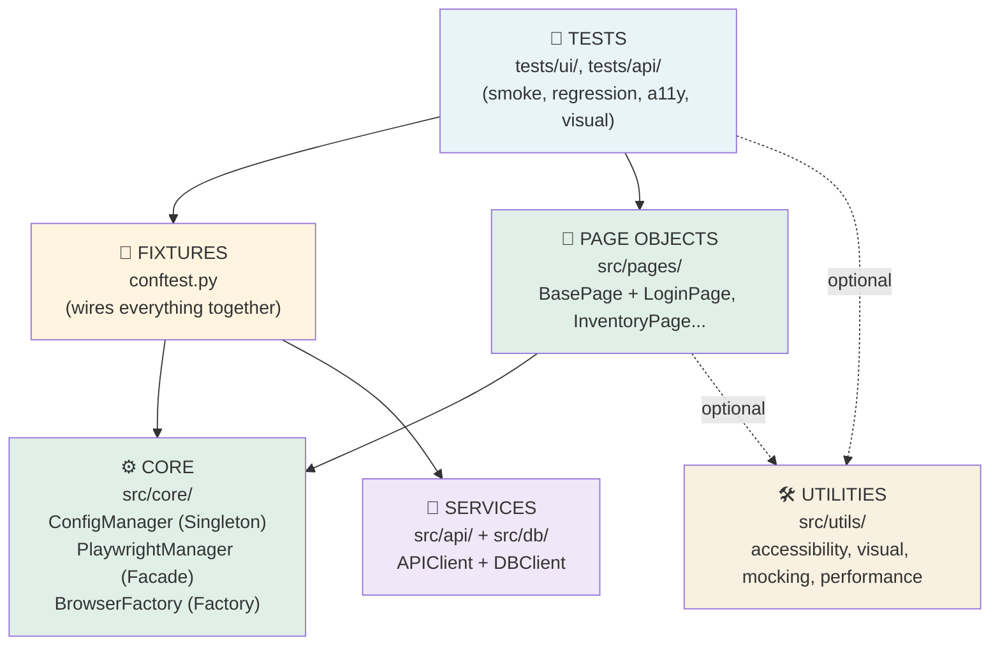
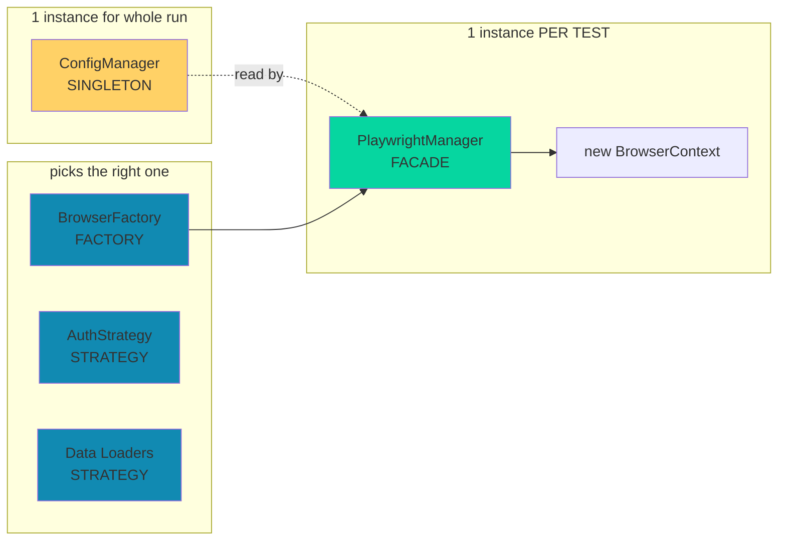

# Framework Architecture — Interview Whiteboard Version

## Simple Layer Diagram (draw this top to bottom)

**How to talk through it, top to bottom:**
"Tests sit at the top and don't know anything about Playwright internals — they just ask pytest for a `page` fixture. That fixture (in conftest.py) is the wiring layer — it goes to Core to actually spin up a browser. Page Objects also depend on Core (they need a `page` object to click things), but Tests only ever talk to Page Objects, never touch Core directly. Services (API/DB) are separate from UI entirely, so an API test never needs a browser at all."

---

## Pattern Cheat-Sheet (say this from memory)

**One-liner per pattern (say these fast, in order):**
1. **Singleton** = "one shared thing" → Config
2. **Facade** = "one button hides many steps" → PlaywrightManager.start()/stop()
3. **Factory** = "give me the right browser, I don't care how" → BrowserFactory
4. **Strategy** = "swap the implementation without changing the caller" → Auth, Data loaders
5. **Template Method + Fluent** = "shared skeleton, chainable calls" → BasePage
6. **Builder** = "construct step by step, override only what you need" → UserDataBuilder
7. **Repository** = "hide the database, expose query()/execute()" → DBClient
